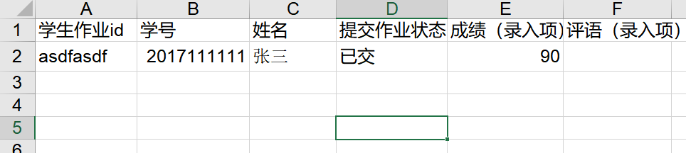

# Utils

### TA tools: calculate students' grades at the end of the semester
  * [code](./score_calculate/cal_score.py)
  * The excel files should be downloaded from the "Web Learning of Tsinghus University（清华大学网络学堂）" and this code can't handle other specific files.
  * The contents of excel file must like this:
    

### Win10 永久激活工具 HWIDGen
  * 会报毒，需要关闭杀软，打开后选择数字激活，软件显示成功后在cmd输入 `>> slmgr.vbs -xpr` 查询是否永久激活
